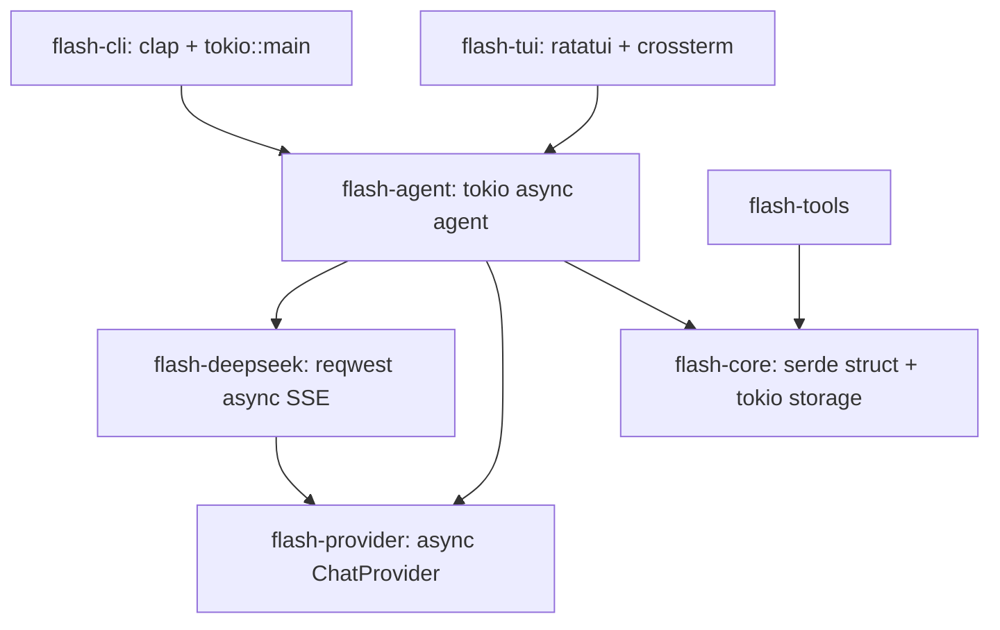

# Flash Code 0.9 现代 Rust 技术栈重构完整技术方案

本文档记录 Flash Code 从零第三方依赖原型演进到围绕现代 Rust 标准生态栈（`tokio` + `clap` + `serde` + `reqwest` + `ratatui` + `crossterm`）的 0.9 重构实施方案。

---

## 1. 重构动机与目标

原代码库在 0.1 ~ 0.8 阶段采用了零第三方依赖的纯标准库实现（如手写 JSON 转义/抽取、手写 `std::env::args()` 参数解析、手写 ANSI 字符串 UI 绘制及 `stty raw` 外部命令）。

为提高项目的健壮性、可维护性、跨平台兼容性（如支持 Windows 终端）以及提供流畅的 LLM 流式体验，我们全面引入以下 6 大标准生态库：

| 技术选型 | 替换的底层实现 | 重构收益 |
|---|---|---|
| **`serde` + `serde_json`** | 手工字符串转义 (`escape_json`) 与正则抽取 (`find_json_string`) | 类型安全的 JSON 序列化与反序列化，防逃逸漏洞与格式错误 |
| **`clap` (v4 derive)** | `main.rs` 手写 `match` 的 `std::env::args()` | 规范的 CLI 解析、自动 `--help` 生成、选项校验与优雅错误提示 |
| **`tokio`** | 同步阻塞逻辑与原生线程（`std::thread` / `std::sync`） | 强大的异步运行时，原生支持 LLM SSE 流式数据接收与 UI 事件异步响应 |
| **`reqwest`** | 拟引入的同步 HTTP 客户端 | 基于 `tokio` 的 async HTTP，原生支持 SSE Body Stream |
| **`ratatui`** | 手写 ANSI 转义码 (`\x1b[2J\x1b[H` 等) | 专业的 TUI 布局 (Layout/Flex) 与富文本控制，支持双缓冲无闪烁渲染 |
| **`crossterm`** | 系统 `stty raw` 命令调用 | 跨平台终端控制（支持 Unix & Windows），原生异步 Event 监听 |

---

## 2. 模块重构设计



### 2.1 `flash-core` （数据协议与存储层）
- 引入 `serde = { version = "1", features = ["derive"] }`, `serde_json = "1"`, `tokio = { version = "1", features = ["fs", "io-util"] }`。
- `Message`, `ContentBlock`, `Event`, `SessionStatus`, `ToolResultStatus`, `ToolRisk`, `PermissionDecision`, `ApprovalMode` 导出 `Serialize, Deserialize`。
- 在 `ContentBlock` 上配合 `#[serde(tag = "type", rename_all = "snake_case")]` 实现标准 JSON Schema。
- `storage.rs` 全量使用 `serde_json` 读写，并通过 `tokio::fs` 实现异步落盘。

### 2.2 `flash-provider` （模型抽象层）
- `ChatProvider` 升级为异步 Trait：
  ```rust
  #[async_trait]
  pub trait ChatProvider: Send + Sync {
      async fn chat(
          &mut self,
          request: ChatRequest,
          on_event: &mut (dyn FnMut(ProviderEvent) + Send),
      ) -> Result<(), ProviderError>;
  }
  ```

### 2.3 `flash-deepseek` （真实 API 网络层）
- 引入 `reqwest = { version = "0.12", features = ["json", "stream"] }`, `tokio`, `eventsource-stream = "0.2"`。
- 使用 `reqwest::Client` 发送 POST 请求到 DeepSeek `/chat/completions`。
- 异步解析 SSE 数据帧 `data: {...}`，将 HTTP 错误状态（429 / 500 等）自动转换为 `ProviderError`。

### 2.4 `flash-agent` （异步 Agent 运行时）
- `AgentRuntime::run_task_with_controls` 改为 `async fn`。
- 内部使用 `tokio::sync::mpsc` Channel 进行 Event 实时分发。

### 2.5 `flash-tui` （终端 UI 层）
- 引入 `ratatui = "0.28"`, `crossterm = "0.28"`。
- 使用 `crossterm::terminal::enable_raw_mode()` 和 `EnterAlternateScreen` 替代外部 `stty` 命令。
- `tokio::select!` 双工监听 `crossterm` 事件流与 `mpsc` Agent 事件。
- 使用 `ratatui` 搭建双栏响应式布局（Session 列表 + 主 Transcript 聊天框 + 底部 Input 栏）。

### 2.6 `flash-cli` （CLI 入口）
- 引入 `clap = { version = "4", features = ["derive"] }`。
- 定义 `#[derive(Parser)]` 结构的 CLI 指令，入口采用 `#[tokio::main]`。

---

## 3. 分阶段实施路线图

- **0.9.1**：基础协议与命令行改造 (`serde` + `clap`)
- **0.9.2**：异步运行时与真实 DeepSeek 网络层 (`tokio` + `reqwest` + `flash-deepseek`)
- **0.9.3**：现代终端 UI 改造 (`ratatui` + `crossterm`)
- **0.9.4**：回归测试与 CI 全量验证

---

## 4. 验收标准

1. `cargo test --all-features` 100% 绿色通过。
2. `flash --help` 输出标准 clap 帮助格式。
3. `flash run` 能真实异步调用 DeepSeek API 并流式打字输出。
4. `flash tui` 呈现平滑不闪烁的双栏终端 UI。
